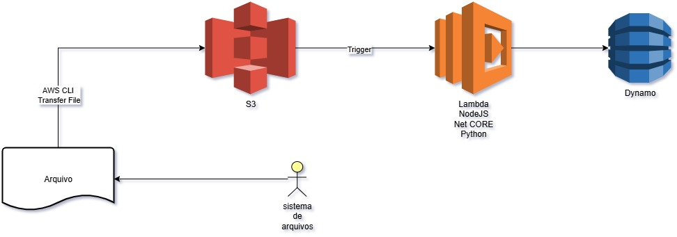
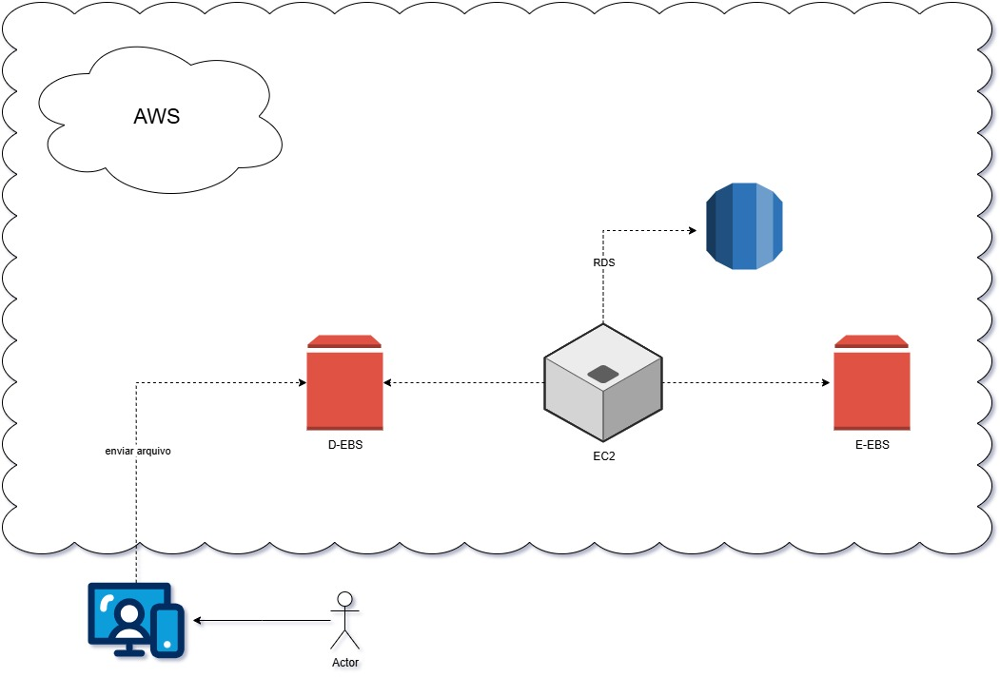

# Desafio AWS - Arquitetura em Nuvem

Este repositório contém a entrega do desafio proposto durante o curso.  
O objetivo foi compreender a utilização de diferentes serviços da AWS e como eles podem se integrar para atender a necessidades de processamento e armazenamento de dados.

---

## 📌 Etapas do Desafio
- Assistir a todas as vídeo-aulas.
- Criar este repositório público no GitHub.
- Documentar a experiência em um arquivo README.md.
- Adicionar diagramas representando a arquitetura.
- Opcionalmente incluir imagens em uma pasta dedicada (`/images`).

---

## 📊 Arquiteturas Desenvolvidas

### 1. Integração com **S3, Lambda e DynamoDB**
Fluxo principal:
1. Um arquivo é enviado para o **Amazon S3** via **AWS CLI**.
2. O **S3** dispara um **trigger** que executa uma função **AWS Lambda**.
3. A função Lambda (em NodeJS, .NET Core ou Python) processa os dados.
4. O resultado é armazenado no **Amazon DynamoDB**.

---

### 2. Integração com **EC2, EBS e RDS**
Fluxo principal:
1. O usuário (actor) envia um arquivo através de sua aplicação.
2. O arquivo é gravado em um **EBS de dados (D-EBS)**.
3. Uma instância **EC2** processa essas informações.
4. Dados estruturados são armazenados no **Amazon RDS**.
5. Os resultados podem ser salvos em outro **EBS (E-EBS)** para persistência.

---

## 🗂 Estrutura do Repositório
├── README.md # Documentação do projeto

└── images/ # Diagramas da arquitetura

├── Desafio-S3.jpg

└── Desafio-EC2.jpg

---

## 🚀 Conclusão
Este desafio permitiu praticar conceitos de:
- Armazenamento em nuvem (S3 e EBS)
- Processamento serverless (Lambda)
- Bancos de dados na AWS (DynamoDB e RDS)
- Integração de serviços AWS em arquiteturas escaláveis

